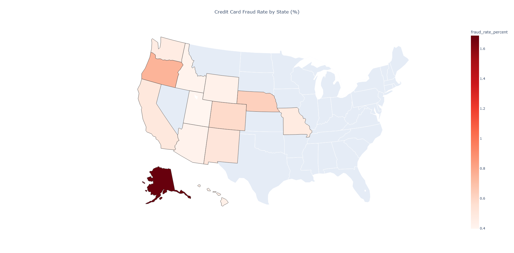

# Credit Card Fraud Detection Analysis (2019-2020)
This repository contains the end-to-end analysis of a credit card transaction dataset to identify and predict instances of fraud. The project involves exploratory data analysis using SQL, Python and Microsoft Power BI.

## Project Overview & Objective
A new credit card company in the western United States wants to establish itself as a market leader in security. The primary objective is to build a predictive model that can accurately identify fraudulent transactions from a provided dataset. A key requirement is that the model should prioritize catching as many fraudulent cases as possible (high recall), even if it means occasionally flagging a legitimate transaction for review.

## Visualizations & Key Dashboards
Below are some of the key visualizations. These charts highlight the primary findings from the exploratory data analysis phase.


## Question 1  
Returns the Top Category in Fradulent Rate %, Total Transactions, Total Fraud Transactions, Average of Fraud Amount and Legit Amount.

[View SQL File](Queries/Query1)

```sql
-- Query 1: What types of purchases are most likely to be instances of fraud?
-- It analyzes fraud rates and average transaction amounts by merchant category.

WITH FraudStats AS (
    SELECT
        category,
        COUNT(*) AS total_transactions,
        SUM(is_fraud) AS fraudulent_transactions,
        AVG(CASE WHEN is_fraud = 1 THEN amt ELSE NULL END) as avg_fraud_amount,
        AVG(CASE WHEN is_fraud = 0 THEN amt ELSE NULL END) as avg_legit_amount
    FROM
        transactions
    GROUP BY
        category
)
SELECT
    category,
    total_transactions,
    fraudulent_transactions,
    (fraudulent_transactions * 1.0 / total_transactions) * 100 AS fraud_rate_percent,
    avg_fraud_amount,
    avg_legit_amount
FROM
    FraudStats
ORDER BY
    fraud_rate_percent DESC;
```

### ✅ Query 1 Result

| Category        | Total Transactions | Fraudulent Transactions  | Fraud Rate (%) | Avg Fraud Amount | Avg Legit Amount |
|-----------------|--------------------|--------------------------|----------------|------------------|------------------|
| shopping_net    | 26,379             | 381                      | 1.44           | 1,001.13         | 73.32            |
| grocery_pos     | 32,732             | 433                      | 1.32           | 315.23           | 122.07           |
| misc_net        | 16,898             | 217                      | 1.28           | 797.16           | 70.90            |
| shopping_pos    | 30,329             | 187                      | 0.62           | 886.33           | 74.94            |
| gas_transport   | 35,089             | 153                      | 0.44           | 12.65            | 62.96            |
| travel          | 10,322             | 33                       | 0.32           | 8.48             | 109.34           |
| misc_pos        | 20,024             | 62                       | 0.31           | 220.21           | 61.48            |
| grocery_net     | 11,355             | 27                       | 0.24           | 12.73            | 54.62            |
| entertainment   | 24,222             | 55                       | 0.23           | 535.51           | 62.45            |
| personal_care   | 24,406             | 55                       | 0.23           | 28.95            | 48.80            |
| kids_pets       | 29,704             | 55                       | 0.19           | 18.60            | 55.93            |
| food_dining     | 23,038             | 38                       | 0.16           | 117.27           | 50.56            |
| health_fitness  | 22,593             | 36                       | 0.16           | 20.33            | 54.22            |
| home            | 32,516             | 50                       | 0.15           | 261.47           | 56.75            |

## Question 2  
Returns the State, Total Transactions, Fraud Transactions, Fraud Rate (%).

[View SQL File](Queries/Query2)

```sql
-- Query 2: Fraud Analysis by State
-- Identifies geographic hotspots for fraudulent activity.
SELECT
    state,
    COUNT(*) as total_transactions,
    SUM(is_fraud) as fraudulent_transactions,
    (SUM(is_fraud) / COUNT(*)) * 100 as fraud_rate_percent
FROM
    transactions
GROUP BY
    state
ORDER BY
    fraud_rate_percent DESC;
```
### ✅ Query 2 Result
| State | Total Transactions | Fraudulent Transactions | Fraud Rate (%) |
|-------|--------------------|--------------------------|----------------|
| AK    | 2,963              | 50                       | 1.69           |
| OR    | 26,408             | 197                      | 0.75           |
| NE    | 34,425             | 216                      | 0.63           |
| CO    | 19,766             | 115                      | 0.58           |
| NM    | 23,427             | 121                      | 0.52           |
| CA    | 80,495             | 402                      | 0.50           |
| MO    | 54,904             | 262                      | 0.48           |
| WA    | 27,040             | 126                      | 0.47           |
| HI    | 3,649              | 16                       | 0.44           |
| WY    | 27,776             | 119                      | 0.43           |
| AZ    | 15,362             | 64                       | 0.42           |
| ID    | 8,035              | 33                       | 0.41           |
| UT    | 15,357             | 61                       | 0.40           |

```python
import pandas as pd
import plotly.express as px

# --- 1. Load Data from CSV ---
try:
    df = pd.read_csv("ccf_data.csv")
    print("CSV loaded successfully.")
    print(df.head())
except Exception as e:
    print(f"Error loading CSV: {e}")
    exit()

# --- 2. Fraud Analysis by State ---
print("Calculating fraud rates by state...")

df_state_fraud = (
    df.groupby("state")
    .agg(
        total_transactions=("state", "count"),
        fraudulent_transactions=("is_fraud", "sum")
    )
    .reset_index()
)

df_state_fraud["fraud_rate_percent"] = (
    df_state_fraud["fraudulent_transactions"] / df_state_fraud["total_transactions"] * 100
)

print("Data aggregated successfully.")
print(df_state_fraud.head())

# --- 3. Create Visualization ---
print("Generating choropleth map...")

fig = px.choropleth(
    df_state_fraud,
    locations='state',                # Column with state abbreviations
    locationmode="USA-states",        # Plot US states
    color='fraud_rate_percent',       # Fraud rate drives color intensity
    scope="usa",                      # Focus map on the USA
    hover_name='state',               # Show state name on hover
    hover_data={                      # Additional data on hover
        'fraud_rate_percent': ':.2f',
        'fraudulent_transactions': True,
        'total_transactions': True
    },
    color_continuous_scale="Reds",
    title="Credit Card Fraud Rate by State (%)"
)

fig.update_layout(
    title_x=0.5,
    geo=dict(
        lakecolor='rgb(255, 255, 255)'
    )
)

```
## Fraud Rate by State

Here’s a preview of the fraud rate map:



🔗 [Click here to view the interactive map](fraud_rate_by_state_map.html)
## Question 3  
Returns the Age Group, Total Transactions, Fraud Transactions, Fraud Rate (%).
[View SQL File](Queries/Query3)
```sql
-- Query 3: Fraud Analysis by Age Group
-- Determines if certain age groups are more susceptible to fraud.
WITH CustomerAges AS (
    SELECT
        is_fraud,
        TIMESTAMPDIFF(YEAR, dob, trans_date_trans_time) AS age
    FROM
        transactions
)
SELECT
    CASE
        WHEN age < 26 THEN '18-25'
        WHEN age BETWEEN 26 AND 35 THEN '26-35'
        WHEN age BETWEEN 36 AND 45 THEN '36-45'
        WHEN age BETWEEN 46 AND 60 THEN '46-60'
        ELSE '61+'
    END AS age_group,
    COUNT(*) as total_transactions,
    SUM(is_fraud) as fraudulent_transactions,
    (SUM(is_fraud) / COUNT(*)) * 100 as fraud_rate_percent
FROM
    CustomerAges
GROUP BY
    age_group
ORDER BY
    age_group;
```
### ✅ Query 3 Result
| Age Group | Total Transactions | Fraudulent Transactions | Fraud Rate (%) |
|-----------|--------------------|--------------------------|----------------|
| 18-25     | 18,840             | 156                      | 0.83           |
| 26-35     | 80,744             | 306                      | 0.38           |
| 36-45     | 74,014             | 260                      | 0.35           |
| 46-60     | 93,119             | 534                      | 0.57           |
| 61+       | 72,890             | 526                      | 0.72           |


