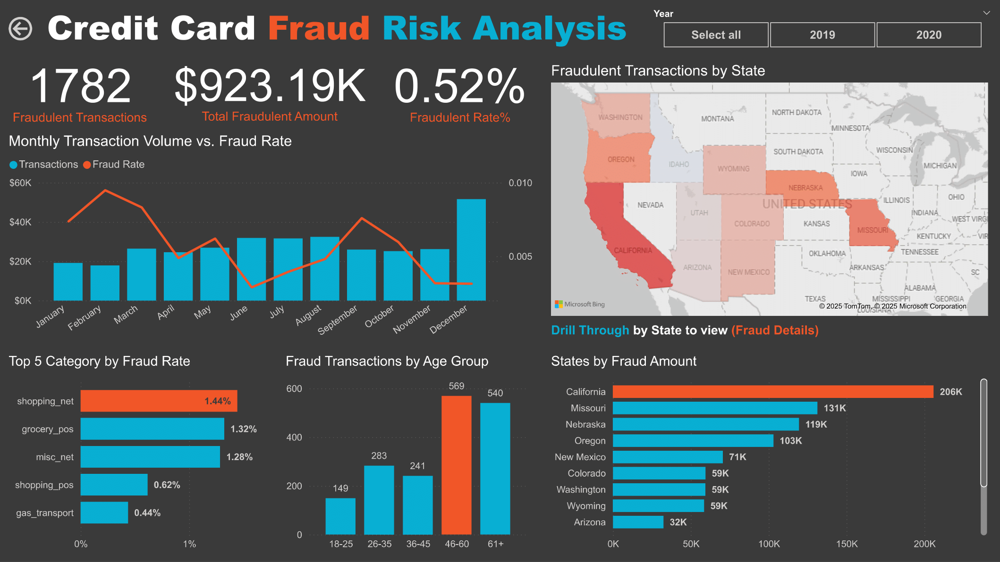

# Credit Card Fraud Detection Analysis (2019-2020)
This repository contains the end-to-end analysis of a credit card transaction dataset to identify and predict instances of fraud. The project combines SQL, and Microsoft Power BI for exploratory data analysis and visualization, with a focus on understanding fraud risk patterns and informing fraud prevention strategies.

## Project Overview & Objective
A new credit card company in the western United States wants to establish itself as a market leader in fraud prevention and security.

The primary objective of this project is to:

* Analyze transaction patterns to uncover fraud risks.

* Build a predictive model that prioritizes high recall (catching as many fraudulent cases as possible), even if this results in some false positives.

* Provide data-driven recommendations to strengthen fraud detection.
## Visualizations & Key Dashboards
Below are some of the key visualizations. These charts highlight the primary findings from the exploratory data analysis phase.

### Microsoft Power BI Dashboard:
### Main Dashboard:



### Data Analysis & Key Insights
Even though fraud makes up less than 1% of transactions, the financial impact is significant.

* Total Fraudulent Transactions: 1,782
* Total Fraudulent Amount: $923,190
* Fraudulent Rate: 0.52% of all transactions


### Demographic and Category Insights
Most Affected Age Groups: These groups represent the majority of fraudulent activity, highlighting older customers as prime targets.
* 46–60 years → 569 fraudulent transactions
* 61+ years → 540 fraudulent transactions

Top Categories by Fraud Rate: Online transactions carry more than double the fraud rate of in-store transactions.
* Online Shopping (shopping_net): 1.44%
* Grocery POS: 1.32%
* Miscellaneous Online (misc_net): 1.28%
* In-store Shopping POS: 0.62%
* Gas/Transport: 0.44%

### Geographic and Merchant Hotspots
Top State by Fraud Amount: California leads all states in total fraudulent losses with $206K. While California records the highest total fraud losses ($206K), Alaska has the highest proportional risk, with a fraud rate of 1.69% despite its smaller transaction volume.

Top State by Fraud Amount
* California → $206K (402 fraud cases out of 80,495 transactions)
* Missouri → $131K (262 fraud cases out of 54,904 transactions)
* Nebraska → $119K (216 fraud cases out of 34,425 transactions)

Top States by Fraud Rate (%)
* Alaska → 1.69% fraud rate (50 fraud cases out of 2,963 transactions)
* Oregon → 0.75% fraud rate (197 fraud cases out of 26,408 transactions)
* Nebraska → 0.63% fraud rate (216 fraud cases out of 34,425 transactions)

### Drill through by State (Fraud Details):


### Drill-Through on California: Within California (the state with the highest total fraud amount):

Top Cities: Glendale, San Diego, and San Jose are the top cities for the number of fraudulent incidents.

Top Merchant Exposure: The merchant “Romaguera, Cruickshank and Greenholt” had the highest exposure to fraudulent transactions, with $6.7K in disputed charges. This indicates a fraud hotspot where prevention measures could be strengthened.

High-Risk Professions: Legitimate cardholders in specialized professions such as Wellsite Geologist and Occupational Therapist were disproportionately targeted, suggesting fraudsters may focus on groups with higher incomes or specific spending patterns.

### Transactional Patterns
Monthly Trends: Fraudulent transactions fluctuate throughout the year, with notable peaks in March, May, and October.

Behavioral Pattern: A common fraud signature was identified: Many fraudulent charges are low-value transactions but occur at unusual distances from the cardholder’s normal location. This suggests card-not-present fraud or account takeover activity, where stolen credentials are first tested with small purchases before larger fraudulent attempts.


## Question 1  
Returns the Top Category in Fradulent Rate %, Total Transactions, Total Fraud Transactions, Average of Fraud Amount and Legit Amount.

[View SQL File](Queries/Query1)

```sql
-- Query 1: Fraud Risk by Purchase Category
-- Objective: Identify which transaction categories carry the highest fraud risk. 
-- This helps prioritize fraud detection efforts for online vs in-person purchases.
WITH FraudStats AS (
    SELECT
        category,
        COUNT(*) AS total_transactions,
        SUM(is_fraud) AS fraudulent_transactions,
        AVG(CASE WHEN is_fraud = 1 THEN amt ELSE NULL END) as avg_fraud_amount,
        AVG(CASE WHEN is_fraud = 0 THEN amt ELSE NULL END) as avg_legit_amount
    FROM
        transactions
    GROUP BY
        category
)
SELECT
    category,
    total_transactions,
    fraudulent_transactions,
    (fraudulent_transactions * 1.0 / total_transactions) * 100 AS fraud_rate_percent,
    avg_fraud_amount,
    avg_legit_amount
FROM
    FraudStats
ORDER BY
    fraud_rate_percent DESC;
```

### ✅ Query 1 Result
Insight:
“Online shopping transactions (shopping_net) show the highest fraud rate at 1.44%, which is more than double the in-store rate (shopping_pos at 0.62%). Fraudulent online purchases also average $1,001, significantly higher than the average legitimate online purchase ($73). This highlights online transactions as a major fraud vector.”

| Category        | Total Transactions | Fraudulent Transactions  | Fraud Rate (%) | Avg Fraud Amount | Avg Legit Amount |
|-----------------|--------------------|--------------------------|----------------|------------------|------------------|
| shopping_net    | 26,379             | 381                      | 1.44           | 1,001.13         | 73.32            |
| grocery_pos     | 32,732             | 433                      | 1.32           | 315.23           | 122.07           |
| misc_net        | 16,898             | 217                      | 1.28           | 797.16           | 70.90            |
| shopping_pos    | 30,329             | 187                      | 0.62           | 886.33           | 74.94            |
| gas_transport   | 35,089             | 153                      | 0.44           | 12.65            | 62.96            |
| travel          | 10,322             | 33                       | 0.32           | 8.48             | 109.34           |
| misc_pos        | 20,024             | 62                       | 0.31           | 220.21           | 61.48            |
| grocery_net     | 11,355             | 27                       | 0.24           | 12.73            | 54.62            |
| entertainment   | 24,222             | 55                       | 0.23           | 535.51           | 62.45            |
| personal_care   | 24,406             | 55                       | 0.23           | 28.95            | 48.80            |
| kids_pets       | 29,704             | 55                       | 0.19           | 18.60            | 55.93            |
| food_dining     | 23,038             | 38                       | 0.16           | 117.27           | 50.56            |
| health_fitness  | 22,593             | 36                       | 0.16           | 20.33            | 54.22            |
| home            | 32,516             | 50                       | 0.15           | 261.47           | 56.75            |

## Question 2  
Returns the State, Total Transactions, Fraud Transactions, Fraud Rate (%).

[View SQL File](Queries/Query2)

```sql
-- Query 2: Fraud Analysis by State
-- Identifies geographic hotspots for fraudulent activity.
SELECT
    state,
    COUNT(*) as total_transactions,
    SUM(is_fraud) as fraudulent_transactions,
    (SUM(is_fraud) / COUNT(*)) * 100 as fraud_rate_percent
FROM
    transactions
GROUP BY
    state
ORDER BY
    fraud_rate_percent DESC;
```
### ✅ Query 2 Result
Insight:
"While California records the highest total fraud losses ($206K), Alaska has the highest proportional risk, with a fraud rate of 1.69% despite its smaller transaction volume."

| State | Total Transactions | Fraudulent Transactions | Fraud Rate (%) |
|-------|--------------------|--------------------------|----------------|
| AK    | 2,963              | 50                       | 1.69           |
| OR    | 26,408             | 197                      | 0.75           |
| NE    | 34,425             | 216                      | 0.63           |
| CO    | 19,766             | 115                      | 0.58           |
| NM    | 23,427             | 121                      | 0.52           |
| CA    | 80,495             | 402                      | 0.50           |
| MO    | 54,904             | 262                      | 0.48           |
| WA    | 27,040             | 126                      | 0.47           |
| HI    | 3,649              | 16                       | 0.44           |
| WY    | 27,776             | 119                      | 0.43           |
| AZ    | 15,362             | 64                       | 0.42           |
| ID    | 8,035              | 33                       | 0.41           |
| UT    | 15,357             | 61                       | 0.40           |

## Question 3  
Returns the Age Group, Total Transactions, Fraud Transactions, Fraud Rate (%).

[View SQL File](Queries/Query3)
```sql
-- Query 3: Fraud Analysis by Age Group
-- Determines if certain age groups are more susceptible to fraud using the provided age column.
SELECT
    CASE
        WHEN age BETWEEN 18 AND 25 THEN '18-25'
        WHEN age BETWEEN 26 AND 35 THEN '26-35'
        WHEN age BETWEEN 36 AND 45 THEN '36-45'
        WHEN age BETWEEN 46 AND 60 THEN '46-60'
        WHEN age >= 61 THEN '61+'
        ELSE 'Under 18'
    END AS age_group,
    COUNT(*) as total_transactions,
    SUM(is_fraud) as fraudulent_transactions,
    (SUM(is_fraud) * 1.0 / COUNT(*)) * 100 as fraud_rate_percent
FROM
    transactions -- Use the 'transactions' table directly
GROUP BY
    age_group
ORDER BY
    age_group;
```
### ✅ Query 3 Result
Insight:
“Older customers (46+) not only account for the majority of fraudulent transactions (1,109 cases), but they also show higher fraud rates (0.56–0.69%) compared to younger groups (0.35–0.38%). This suggests fraudsters disproportionately target older cardholders, making them an important focus for prevention and awareness campaigns.”

| age_group | total_transactions | fraudulent_transactions | fraud_rate_percent |
|-----------|--------------------|--------------------------|--------------------|
| 18-25     | 17,622             | 149                      | 0.84553            |
| 26-35     | 73,100             | 283                      | 0.38714            |
| 36-45     | 68,678             | 241                      | 0.35091            |
| 46-60     | 101,763            | 569                      | 0.55914            |
| 61+       | 78,444             | 540                      | 0.68839            |


